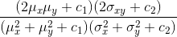

# ssim_gluon

Implementation of a SSIM loss function in MXNet Gluon. Implementation is based on Po Hsun Su's PyTorch implementation of [SSIM](https://github.com/Po-Hsun-Su/pytorch-ssim). 

## What is SSIM
SSIM stands for  Structural Similarity Index and is a perceptual metric to measure similarity of two images.
Commonly used loss functions such as L2 (Euclidean Distance) correlate poorly with image quality because they assume pixel-wise independance. For instance  blurred images cause large perceptual but small L2 loss. 

SSIM takes into account luminance, contrast and structure and is computed as follows:

 

To compare L2 loss and SSIM loss for a given image, execute `python run.py myimage.jpg`.

